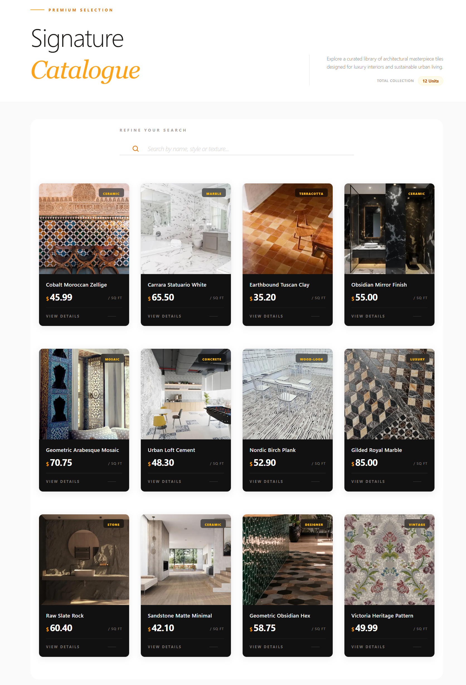
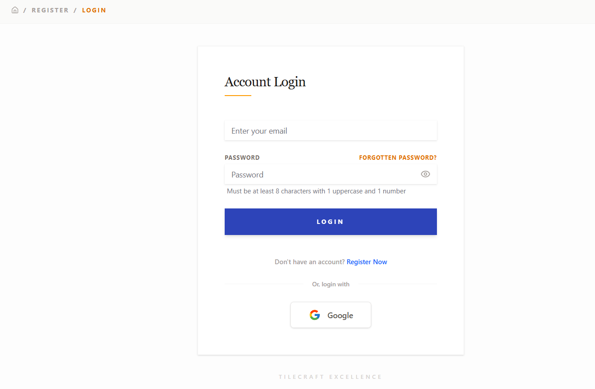
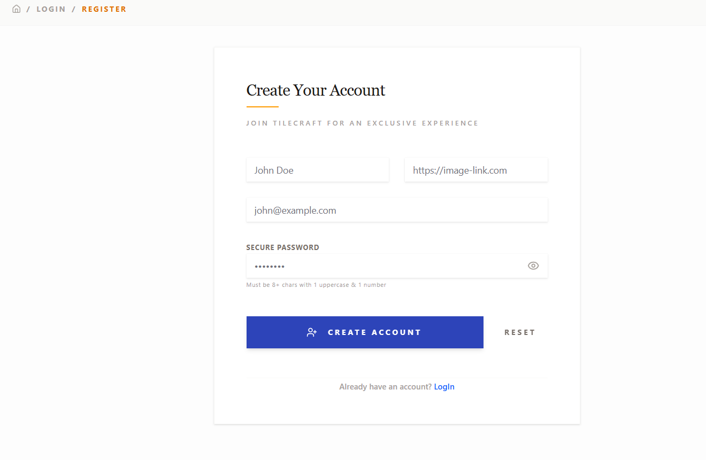
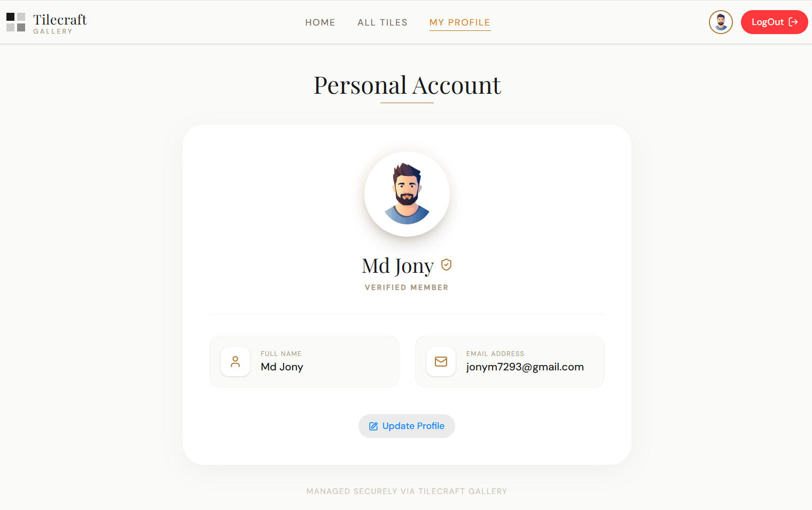

  # 🏺 Tilecraft Gallery
  **The Future of Architectural Surface Aesthetics**

  
  
  

  [Explore Live Demo](https://a-8-tiles-gallery-project.vercel.app/) • [Report Bug](https://github.com/MHJony1/A-8-Tiles-Gallery-Project/issues)

---

## 📖 Project Essence
**Tilecraft Gallery** is a premium digital exhibition showcasing elite tile textures. Built with the cutting-edge **Next.js 16** and **Tailwind CSS 4**, this application demonstrates a high-end interface designed for modern architects and interior designers.

## 💎 Core Value Propositions

### 🏹 Cutting-Edge UI/UX
*   **Modern Styling:** Powered by **Tailwind CSS 4** for high-performance utility-first design.
*   **Fluid Animations:** Smooth transitions and luxury material-inspired color palettes.
*   **Full Responsiveness:** Optimized for everything from mobile screens to ultra-wide displays.

### ⚙️ Technical Architecture
*   **Next.js 16 (App Router):** Utilizing the latest server-side rendering (SSR) and optimized data fetching.
*   **Swiper.js:** Premium carousels for showcasing 'Architectural Masterpieces'.
*   **Real-time Interaction:** Advanced search and filtering on the catalogue page.

## 🛠️ Built With

| Category | Technology |
| :--- | :--- |
| **Framework** | **Next.js 16** |
| **Styling** | **Tailwind CSS 4** |
| **UI Library** | **Hero UI** |
| **Authentication** | **Better Auth** |
| **Slider(npm package)** | **Swiper.js** |
| **Package Manager** | **pnpm** |

---

## 🖼️ Project Showcase & Overview

### 🏠 01. Homepage Experience

  
  
<em>The main landing page featuring Hero Sliders and Signature Collections.</em>

 

### 🔍 02. Global Catalogue (All Tiles)

  
  
<em>Complete catalogue with real-time search functionality.</em>

 

### 👤 03. User Account & Security

  <table style="width:100%">
    <tr>
      <td width="33%"></td>
      <td width="33%"></td>
      <td width="33%"></td>
    </tr>
  </table>
  
<em>Integrated Login, Registration, and Personalized User Profile management.</em>

---

## 👤 About the Developer
**Mahmudul Hasan (Jony)**  
*Full Stack MERN Developer*

---

  
Crafted with ❤️ by Mahmudul Hasan Jony

<<<<<<< HEAD

>>>>>>> 094b0fc14fc1b70d5a5a44b4d0d5b6ecbe619231
